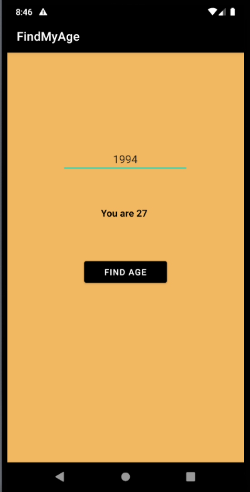

# KotlinAndroidTutorials

## 21 Day Kotlin Khallenge 
I am challenging myself to a 21 day Kotlin Khallenge where in Kotlin making Android apps for 21 days straight. I will be posting about my progress here. 

## Day 1 
I spent my time coding in Kotlin today going over basic coding techniques that I am familiar with from java. Some of the concepts I refreshed myself on were multi-threaded 
programming, comparable, file read and write, and singleton design pattern.

## Day 2 (Find My Age app)
I wanted to start off easy. This is an application where a user can enter the year they were born and tap on the find age button and the application will display the age. 
Some technologies I refreshed myself on was textview, edittext, constraint layout, and accessing UI with kotlin.

## Day 3 (Tic Tac Toe App)
Got started with a tic tac toe game application. Learning table layout, table rows, margins, gravity, and how to implement logic to change colors and texts using code. Kotlin is awesome. 

## 4 (Tic Tac Toe App)
Spent 40 minutes coding in Kotlin today because I am planning to go to the North End with my girlfriend for pizza. I spent 20 minutes of it trying to change the color of a button when you click on it. Surprisingly, this is way more complicated than you would think in Android. The tic tac toe logic is basic logic using if/else statements and works now if two people are playing. Tommorow, I am going to implement the game so that you can play solo against the computer. Im thinking about using minmax algorithm to do this using AI. Most likely I will make it so the computer selects a random square. I dont want to spend to much time on a simple aplication because the goal is to get good at android development. Anyways, be back tommorow.

